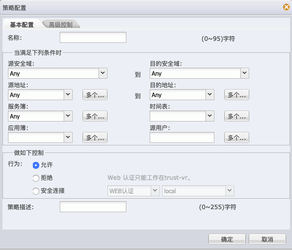
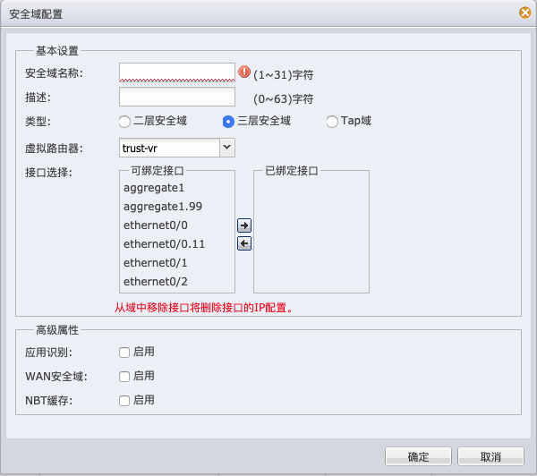
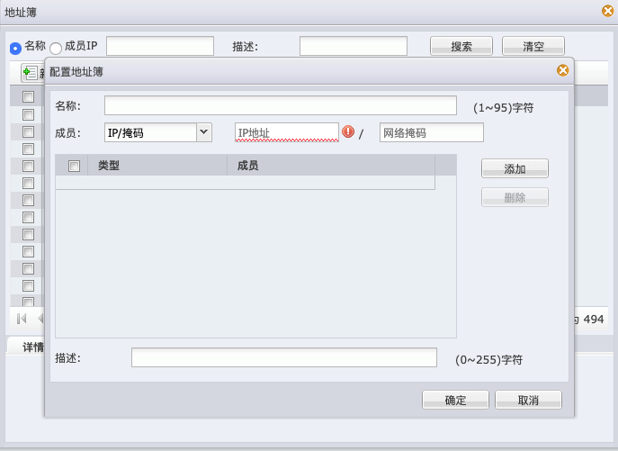
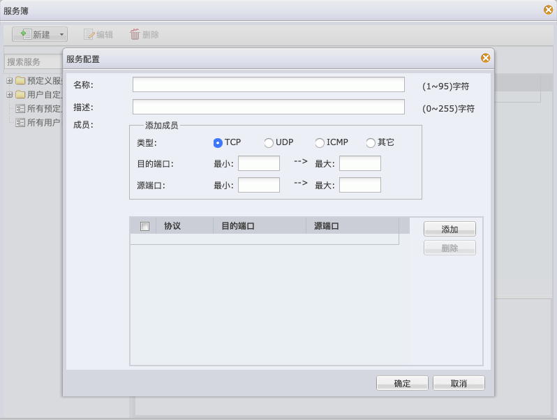

<!-- TOC -->

- [ACL](#acl)
    - [访问控制](#访问控制)
    - [安全策略](#安全策略)
        - [安全域对象](#安全域对象)
        - [地址对象](#地址对象)
        - [服务对象](#服务对象)
        - [组对象](#组对象)
    - [CLI命令整理](#cli命令整理)
        - [奇安信防火墙 （极速墙、智慧墙）](#奇安信防火墙-极速墙智慧墙)
        - [华为墙](#华为墙)
        - [H3C防火墙](#h3c防火墙)
        - [山石防火墙](#山石防火墙)
        - [飞塔防火墙](#飞塔防火墙)
        - [启明星晨防火墙](#启明星晨防火墙)
    - [HTTP API整理](#http-api整理)
        - [山石防火墙](#山石防火墙-1)

<!-- /TOC -->

# ACL

## 访问控制

参考：
[wiki](https://en.wikipedia.org/wiki/Access-control_list)
[rfc8519](https://tools.ietf.org/html/rfc8519)

主要用于交换机和路由器的访问控制，核心功能是通过网络协议来识别网络流量，并控制流量经过设备的行为

1. 网络流量匹配规则定义

    - 链路层匹配规则
        - 流量入接口
        - 流量出接口
    - 网络层匹配规则
        - 源IP地址
        - 目的IP地址
    - 传输层匹配规则
        - TCP
            - 源端口
            - 目的端口
        - UDP
            - 源端口
            - 目的端口
        - ICMP
            - type
            - code
    - 其他网络协议匹配
        - Telnet
        - FTP
        - TFTP
        - 等等

2. 控制行为

    - PERMIT
    - DENY

## 安全策略

在网络中，防火墙的作用之一就是ACL，而安全策略是防火墙针对ACL对象化后的产物，目的是减少ACL的管理成本。从目前调研的结果来看，安全策略的定义并没有统一的标准，各个防火墙厂商的实现存在差异

### 安全域对象

链路层接口匹配规则对象化

### 地址对象

网络层IP地址对象化

### 服务对象

传输层及以上协议匹配规则对象化

### 组对象

将相同类别对象合并在一起形成一个管理对象

## CLI命令整理

### 奇安信防火墙 （极速墙、智慧墙）

- [security-policy](device/cli/qianxin/secGate3600_3.6.6.0/security-policy.xml)
- [zone](device/cli/qianxin/secGate3600_3.6.6.0/zone.xml)
- [address](device/cli/qianxin/secGate3600_3.6.6.0/address.xml)
- [address-v6](device/cli/qianxin/secGate3600_3.6.6.0/address-v6.xml)
- [service](device/cli/qianxin/secGate3600_3.6.6.0/service.xml)
- [system-info](device/cli/qianxin/secGate3600_3.6.6.0/system.xml)

### 华为墙

- [acl](device/cli/huawei/USG6300/acl.xml)
- [security-policy](device/cli/huawei/USG6300/security-policy.xml)
- [zone](device/cli/huawei/USG6300/zone.xml)
- [address](device/cli/huawei/USG6300/address.xml)
- [service](device/cli/huawei/USG6300/service.xml)
- [system-info](device/cli/huawei/USG6300/system.xml)

### H3C防火墙

基本类似华为墙，CLI的设计和使用上都和华为很类似

### 山石防火墙

类似奇安信防火墙，功能上是奇安信防火墙的子集

### 飞塔防火墙

### 启明星晨防火墙

## HTTP API整理

### 山石防火墙

- 安全策略

    

- 安全域

    

- 地址（仅支持IPV4地址）

    

- 服务

    
